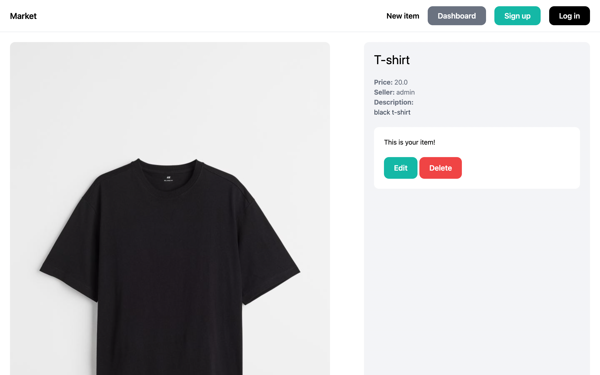
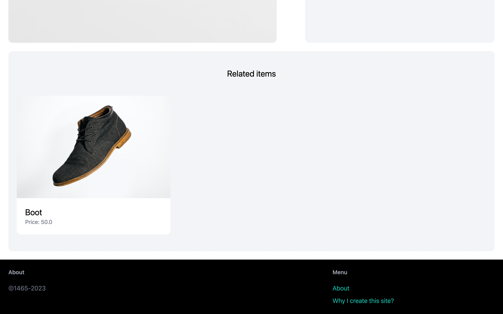

# Online market created by Django

This is an online market application built using Django, a powerful web framework for Python. The application allows users to buy and sell products online in a secure and user-friendly manner.

---

## Features

• User registration and authentication: Users can sign up, log in, and manage their accounts.  
• Product listings: Users can create, update, and delete their product listings.  
• Admin dashboard: An admin dashboard for site administrators to manage users, products, orders, and other site content.  
• Responsive design: The application is designed to be responsive and accessible on various devices.  

---

## Contributing

Contributions to the Online Market Django application are welcome! If you find any bugs or have suggestions for improvement, please open an issue or submit a pull request.

To contribute:

1. Fork the repository.
2. Create a new branch for your feature or bug fix.
3. Make the necessary changes.
4. Test your changes.
5. Commit your changes and push them to your forked repository.
6. Submit a pull request to the main repository.

---

## Screenshots

|  |  |
| ------------------ | ------------------ |
|                  |                  |

---
